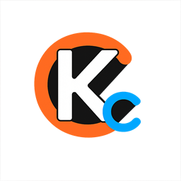

<div align="center">
  

  <h1>KCC Workbench</h1>

  <p><a href="./README.md">简体中文</a> · <strong>English</strong></p>

  <p><strong>Seamlessly switch between Kimi Code, Claude Code, and Codex in one GUI</strong></p>
  <p>Then turn generated files into readable, reviewable, and recoverable work with a human-friendly AI artifact Viewer.</p>

  <p>
    <a href="https://github.com/Dylan5237/kcc-workbench/actions/workflows/ci.yml"></a>
    
    
    
  </p>

  <p>
    <a href="#quick-start">Quick Start</a>
    ·
    <a href="#core-capabilities">Features</a>
    ·
    <a href="https://github.com/Dylan5237/kcc-workbench/releases">Download</a>
    ·
    <a href="./PRIVACY.md">Privacy</a>
    ·
    <a href="./SECURITY.md">Security</a>
  </p>
</div>

> [!IMPORTANT]
> KCC Workbench is an unofficial community project. It is not affiliated with, sponsored by, or endorsed by Moonshot AI, Anthropic, OpenAI, or the CloudCLI project. Related names and marks belong to their respective owners.

## Two defining features

> **01 · Kimi Code / Claude Code / Codex, seamless switching, one GUI**
>
> Kimi Web and CloudCLI run as separate persistent views. Use Kimi Code, Claude Code, and Codex in the same desktop window; click the top-left logo or press `Alt+Q` to switch entry points without reopening windows or reloading active sessions.

> **02 · A human-friendly AI artifact Viewer**
>
> The Viewer follows the selected session's project directory and turns scattered AI-generated files into a live tree, rendered previews, source views, and line-by-line diffs. Markdown, Mermaid, JSON, HTML, image copy, current-round artifacts, and Time Machine all live in one interface—so people can understand, review, and recover the work.

## Why this workbench

Kimi Code, Claude Code, and Codex each provide complete workflows, but their entry points, sessions, and artifacts are separate. KCC Workbench adds one local shell: Kimi uses the local Kimi Web service, while Claude Code and Codex run through the bundled CloudCLI package.

| Use case | What the workbench provides |
| --- | --- |
| Switching among Kimi, Claude Code, and Codex | Gives all three coding agents one GUI while keeping Kimi and CloudCLI views alive without reloading either page |
| Not knowing how long your Coding Plan quota will last | Synchronizes quota on demand and estimates depletion risk from local usage history |
| Configuration files that are hard to discover and easy to mis-edit | Exposes common settings in a visual interface with explicit saves and backups |
| Session-generated files scattered across a project | Combines a live file tree, friendly previews, line diffs, and native file copy |
| Revisiting or continuing from an earlier state | Saves artifact checkpoints and can safely fork a new Git workspace |

## Core capabilities

| | Capability | Description |
| --- | --- | --- |
| **01** | **Three coding agents, one GUI** | Use Kimi Code / Claude Code / Codex in one window; Kimi Web and CloudCLI stay alive independently, and the top-left logo or `Alt+Q` switches entry points without reloading sessions. |
| **02** | **Coding Plan quota** | On the Kimi engine, synchronizes total quota, Kimi / Code shares, five-hour usage, seven-day usage, and reset times only when requested. |
| **03** | **Quota Autopilot** | Stores local quota samples and estimates depletion risk from consumption velocity, turning a percentage into a clearer pacing signal. |
| **04** | **Visual Kimi configuration** | On the Kimi engine, manages models, thinking, Agent behavior, permissions, MCP, Skills, Hooks (read-only in this release), workspaces, and system prompts; nothing is written until you save. |
| **05** | **Human-friendly AI artifact Viewer** | Follows the selected Kimi or CloudCLI session directory, renders Markdown / Mermaid, JSON, and HTML, and supports filtering, source/preview switching, line diffs, image copy, and native Windows file copy. |
| **06** | **Task time machine** | Persists artifact checkpoints, replays historical content and diffs, and creates an isolated branch + worktree from a checkpoint in Git projects. |

### Two persistent engines, one shared Viewer

```text
Kimi Web ─────┐
              ├── selected session root ──▶ File Viewer / Artifacts / Time Machine
CloudCLI ─────┘

Kimi-only: Coding Plan quota / Restart Home / System Settings
```

Click the top-left logo or press `Alt+Q` to switch engines. Settings, Restart Home, and Quota appear only on Kimi Home.

## Quick start

### 1. Prerequisites

- Windows 10 / 11 x64
- Kimi Code CLI installed
- `kimi web` can start the local Web UI from PowerShell
- No global CloudCLI installation is required; `@cloudcli-ai/cloudcli` is packaged with the app
- **CloudCLI currently still requires a compatible system Node.js 22 runtime**; when Node is missing or ABI-incompatible, Kimi remains usable but CloudCLI shows an error page
- Access to `https://www.kimi.com` when synchronizing quota

### 2. Download and run

Download the Windows portable asset for the desired version from [Releases](https://github.com/Dylan5237/kcc-workbench/releases). KCC builds use the name `KCC-Workbench-*-x64.exe`.

> [!TIP]
> On first launch, verify Kimi Home, then switch to CloudCLI and complete its account setup or sign-in. Quota is never synchronized automatically and is available only on Kimi Home.

### 3. Start working

1. Open a Kimi session from Home, or switch to CloudCLI and open a Claude Code / Codex session.
2. Switch to File Viewer. The workbench prefers the selected session directory for the active engine.
3. Open Current Artifacts to inspect created, modified, and deleted files with line diffs.
4. Switch back to Kimi before opening System Settings; review changes and explicitly save them.

Kimi resolves its workspace through the Kimi session API. CloudCLI prefers `/session/:id` plus its authenticated same-origin session-details API; JSONL activity is fallback only. If detection still fails, Viewer keeps the last root. Diagnostics are written to `%APPDATA%\KCC Workbench\viewer-context.log`.

## Feature details

<details>
<summary><strong>Coding Plan quota and forecasting</strong></summary>

- Reads total quota, Kimi / Code shares, five-hour usage, seven-day usage, and their reset times from the Kimi quota page.
- Keeps login state in a persistent Electron session without writing cookies into quota history JSON.
- Visits the quota page only after you click “Update”; there is no scheduled background scraping.
- Quota Autopilot calculates locally from saved samples and avoids presenting a forecast when there is not enough data.

</details>

<details>
<summary><strong>Visual configuration</strong></summary>

- This feature is Kimi-only. When CloudCLI is active, the Settings entry is hidden and the main process rejects direct navigation.
- General settings, models and thinking, Agent execution, permissions, and tools.
- Model editor: add, modify, or remove third-party `[models."alias"]` entries (model / display_name / provider / api_key / base_url / max_context_size / capabilities) with safe alias validation and preservation of unknown configuration.
- MCP services, Skills, Hooks, workspaces, and advanced diagnostics.
- User-level `SYSTEM.md` and global `AGENTS.md` system prompts.
- Every edit requires an explicit save, with a `.bak` backup created before overwriting.
- Demo mode and automated tests always use an isolated configuration directory and never touch real Kimi configuration.

</details>

<details>
<summary><strong>File Viewer and session artifacts</strong></summary>

- Friendly Markdown rendering, source view, and Mermaid diagrams.
- Table, tree, and raw views for JSON.
- Sandboxed HTML preview and source view with scripts, forms, and external network access disabled by default.
- Live file-tree updates, filename filtering, adjustable width, path copy, and native Windows file copy.
- Current Artifacts combines created, modified, and deleted files with line-level diffs.

</details>

<details>
<summary><strong>Task time machine</strong></summary>

- Persists artifact checkpoints per active Kimi or CloudCLI conversation.
- Replays historical Markdown, JSON, and HTML content with file-level diffs.
- Stores size-limited patches and untracked-file snapshots for Git projects.
- Creates an isolated branch + worktree from any checkpoint for continued development.
- Does not provide an in-place rollback that could overwrite the current project.

</details>

## Data and security boundaries

| Data or operation | How it is handled |
| --- | --- |
| Kimi Web | Home connects only to local `127.0.0.1 (random port)`; network behavior is owned by the local Kimi Code service |
| CloudCLI | Starts the bundled local CloudCLI service; provider requests, accounts, and authentication are governed by CloudCLI and its configuration |
| Viewer context log | Locally records engine, session identifier, absolute project path, and API/fallback status; it does not record tokens or cookies |
| Quota login state | Managed by a persistent Electron Chromium session and never written to quota history |
| Quota synchronization | Visits the Kimi quota page only after a user-initiated update |
| Configuration changes | Written only after an explicit save, with a `.bak` backup created first |
| HTML preview | Uses sandboxing, CSP, and resource allowlists without executing page scripts |
| Time machine | Stores snapshots in local app data; snapshots may contain project file content |
| Git fork | Creates a new branch + worktree after confirmation without rewriting the current workspace |

Read the complete [Privacy Notice](./PRIVACY.md) and [Security Policy](./SECURITY.md). Before opening an issue, remove accounts, cookies, tokens, project source code, and absolute local paths from logs.

## Run from source

Development requires Node.js 22 and npm.

```powershell
git clone https://github.com/Dylan5237/kcc-workbench.git
cd kcc-workbench
npm ci
npm test
npm start
```

Start the demo with an isolated configuration profile:

```powershell
npm run demo -- --demo-profile=manual-test
```

Build an unpacked Windows app:

```powershell
npm run build
& ".\dist\win-unpacked\KCC Workbench.exe"
```

Build a portable release (one-click, recommended):

```powershell
npm run pack          # one-click: test -> clean dist -> package -> report artifact path and size
npm run pack -- fast  # fast: skip tests/portable compression -> dist-fast/win-unpacked
```

Run `pack.bat fast` from the repository root for day-to-day validation, then launch `dist-fast/win-unpacked/KCC Workbench.exe`; double-clicking `pack.bat` still performs the full portable build. Use `pack.bat --no-test` when only the test phase should be skipped. Fast mode still cleans its own `dist-fast/` directory, so it does not reuse stale output.

Pushes and pull requests run tests and a Windows build in GitHub Actions. Tags matching `v*` trigger the portable release workflow.

## FAQ

<details>
<summary><strong>Is this an official Kimi client?</strong></summary>

No. This is an independently developed, unofficial desktop workbench and does not represent Moonshot AI or Kimi.

</details>

<details>
<summary><strong>Does the workbench fetch quota in the background?</strong></summary>

No. It synchronizes quota only after you click “Update”, and forecasting is performed entirely from local history.

</details>

<details>
<summary><strong>Does opening System Settings change my Kimi configuration?</strong></summary>

No. Browsing and editing a draft do not write any file. Changes are written only after an explicit save, with a backup created first.

</details>

<details>
<summary><strong>Do I need to install CloudCLI globally?</strong></summary>

No. The CloudCLI npm dependency is packaged with the app. The current release does not yet bundle a Node runtime, so a compatible Node.js 22 installation is still required; this is a known release limitation.

</details>

<details>
<summary><strong>Does Time Machine roll back my project in place?</strong></summary>

No. It provides historical playback. When you continue from a checkpoint in a Git repository, it creates an isolated worktree instead of overwriting the current directory.

</details>

## Project status and participation

The project released **v1.0.0** stable and prioritizes local, single-user workflows on Windows. The KCC dual-engine work and the zip packaging switch are on `main` and passed Windows CI. Real signed-in Kimi / Claude Code / Codex sessions, the CloudCLI Viewer-path acceptance, and the RC clean-environment acceptance are all completed. Two known limitations remain: a compatible Node.js 22 runtime is not yet bundled (CloudCLI needs system Node 22 / ABI 127), and CloudCLI's transitive frontend dependencies still carry 4 moderate advisories with no upstream fix yet. You can participate through:

- [GitHub Issues](https://github.com/Dylan5237/kcc-workbench/issues) for bug reports and feature requests
- [Pull Requests](https://github.com/Dylan5237/kcc-workbench/pulls) for focused, verifiable improvements
- [Changelog](./CHANGELOG.md) for the current release scope

## License

The project's own code is licensed under the [MIT License](./LICENSE). Bundled third-party components, including CloudCLI, remain subject to their own licenses; binary distribution must comply with those terms as well.

---

<div align="center">
  <sub>Kimi Code · Claude Code · Codex, in one local Windows workbench.</sub>
</div>
