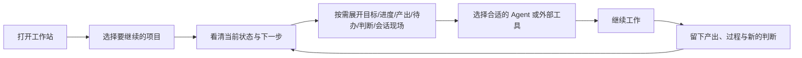
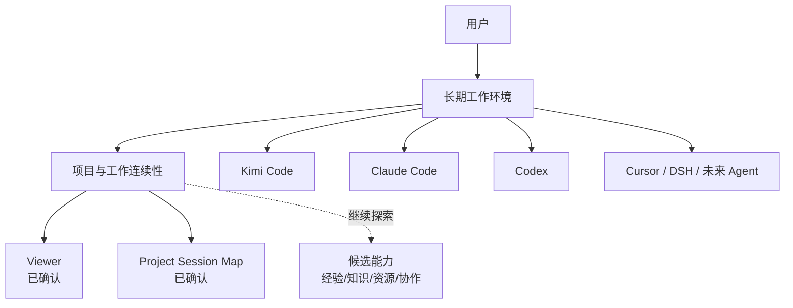

# Arckeep 概要设计 v0.1

> 状态：探索版概要设计  
> 更新日期：2026-08-26  
> 关联文档：[产品设计哲学](./PRODUCT_DESIGN_PHILOSOPHY.md)  
> 产品名：`Arckeep`（2026-08-27 正式确定）  
> 说明：本文用于建立可讨论的整体骨架，不是 PRD、详细设计、路线图或开工依据。仓库名、应用包名和发布标识的迁移另行决定。

## 1. 文档目的

本文回答五个问题：

1. Arckeep 正在从什么产品走向什么产品？
2. 用户最核心的工作旅程是什么？
3. 哪些部分应长期稳定，哪些部分应允许持续更换？
4. Viewer、Project Session Map 和其他候选能力如何放入同一整体？
5. 下一轮产品探索还需要回答哪些关键问题？

本文不回答具体页面尺寸、数据库表结构、接口协议、技术选型、版本排期和开发任务拆分。

## 2. 阅读约定

为避免把探索误写成事实，本文使用三种标记：

- **现状**：仓库当前已经存在并可运行的能力。
- **目标**：已经由产品设计哲学支持的长期方向，但不代表已经实现。
- **候选**：真实需求或可能的承载方式，仍需继续探索，不能据此直接开工。

## 3. 产品定义

### 3.1 一句话定义

Arckeep 是用户自己的**长期 AI 工作环境**：以项目和工作为中心，连接可替换的 Agent，保留工作历史、产出和认知演变，帮助用户准确地继续工作并持续进步。

### 3.2 核心追求

> **让工作连续，让进步复利。**

“工作连续”意味着：无论上次使用哪个 Agent、在哪个会话停下，用户回来后都能恢复目标、进度、最近产出、待办、关键判断和上一次会话现场。

“进步复利”意味着：一次产出不会散失，一次探索不会白费，一次纠正不会因换会话或换 Agent 而自动归零；但未经确认的临时理解也不会被擅自固化成永久规则。

### 3.3 产品不是什么

Arckeep 不以成为以下产品为目标：

- 把多个 Agent 网页拼在一起的入口集合；
- 强迫所有 Agent 使用同一种交互方式的统一壳；
- 重新实现 IDE、终端、Git、任务管理和所有 Agent UI 的超级应用；
- 把所有历史无差别塞进上下文的“大记忆库”；
- 用自动化替代用户判断、让用户逐渐失去掌控感的黑箱。

## 4. 当前产品与目标产品

### 4.1 当前产品基线

**现状：** 当前仓库已经是一款可运行的 Windows Electron 桌面应用，主要能力包括：

- Kimi Code 与 CloudCLI 的常驻工作入口；
- 通过 CloudCLI 使用 Claude Code / Codex；
- 跟随当前会话项目目录的 Viewer；
- 会话产物、Diff 和时间机器；
- Kimi 额度、配置和 Skills 管理等辅助能力。

当前产品的重心可以概括为：

> 多个 Coding Agent 共用一个 GUI，再共用一个产物 Viewer。

### 4.2 目标产品重心

**目标：** 未来产品的第一层对象从“Agent/引擎”转向“项目/工作”。用户先选择要继续的项目，再决定由哪个 Agent 参与。

目标重心可以概括为：

> 用户进入同一个长期工作现场，Agent 只是其中可更换的工作方式。

### 4.3 需要完成的重心迁移

| 当前重心 | 目标重心 |
| --- | --- |
| 先进入 Agent，再寻找会话和目录 | 先进入项目，再选择 Agent |
| Viewer 跟随当前会话 | 会话和 Viewer 共同从属于项目 |
| 会话是主要导航对象 | 项目是主要导航对象，会话是项目经历 |
| 各引擎能力分别组织 | 稳定工作能力与 Agent 接入分开 |
| 历史主要用于回看 | 历史同时帮助恢复现场和形成下一步 |

这不是要求推翻当前产品重做。现有引擎入口、Viewer、时间机器、额度和设置都可能继续发挥价值，但需要重新判断它们在“长期工作环境”中的位置。

## 5. 核心用户旅程：继续一项工作

“继续工作”是本概要设计的中心旅程。其他能力应围绕它提供帮助，而不是与它争夺产品中心。

### 5.1 理想过程



### 5.2 用户回来时必须恢复的六类信息

| 信息 | 用户真正想知道的问题 |
| --- | --- |
| 目标 | 这项工作最终要达到什么结果？ |
| 进度 | 当前走到哪里，哪些已经真实完成？ |
| 最近产出 | 上一次工作具体留下了什么？ |
| 待办 | 接下来还有什么需要处理？ |
| 关键判断 | 为什么采用当前方向，哪些旧结论已经失效？ |
| 会话现场 | 上一次对话在什么语境中停下，如何继续？ |

六类信息都需要存在，但不应同时平铺。默认先呈现“当前状态”和“下一步”，其余信息按需要逐层展开。

### 5.3 成功体验

用户离开项目数天后重新打开，不需要先回忆上次用了哪个 Agent，也不需要翻找聊天记录或手工拼接背景。他能够在短时间内回答：

- 我现在在做什么？
- 项目真实做到哪里？
- 最近产生了什么结果？
- 当前最合理的下一步是什么？
- 如果我不认同当前判断，证据和历史在哪里？
- 我可以让哪个 Agent 从这里继续？

## 6. 概念模型

本节描述工作站需要理解的“东西”，不是最终模块拆分或数据库设计。

### 6.1 核心概念

| 概念 | 含义 | 当前定位 |
| --- | --- | --- |
| 项目 Project | 一项长期工作的稳定身份，连接目录、历史、产出和工作状态 | 核心 |
| 目标 Goal | 项目或阶段希望达到的结果 | 核心信息，承载方式待定 |
| 进度 Progress | 基于真实证据形成的当前状态，而不是 Agent 自我报告 | 核心信息，生成方式待定 |
| 待办 Next Work | 尚未完成、需要继续处理的工作 | 核心信息，管理方式待定 |
| 会话 Session | 某个 Agent 在特定时间参与项目的一段工作经历 | 核心 |
| 产出 Artifact | Agent 或用户在工作过程中产生、修改或确认的文件和结果 | 核心；Viewer 已确认 |
| 关键判断 Decision | 对项目方向有影响、能够说明“为什么”的认知节点 | 核心信息，承载方式待定 |
| 工作现场 Work Context | 某一时刻继续工作所需的最小相关上下文 | 核心信息，形成方式待定 |
| Agent 接入 Agent Adapter | 把某个可变化的 Agent 带入项目工作现场的连接方式 | 可替换边缘 |

### 6.2 候选概念

以下概念来自真实需求，但尚未被确认成独立模块：

| 候选概念 | 可能解决的问题 | 尚未回答的问题 |
| --- | --- | --- |
| 个人记忆与经验 | 让不同 Agent 理解用户身份、判断原则、协作偏好和可复用经验 | 如何避免把临时指正固化成永久规则？如何让记忆归用户治理？ |
| 项目知识 | 更换 Agent 后仍能理解项目背景和稳定事实 | 与项目文档、记忆、会话摘要如何分工？ |
| 能力资产 | Skills、MCP、规则在不同 Agent 间复用 | 哪些可以统一，哪些必须保留原生形态？ |
| Agent 资源 | Coding Plan、额度和可用性 | 是核心决策信息，还是独立工具页？ |
| 协作关系 | 多个 Agent 如何共同参与项目 | 哪些模式真实稳定，哪些只是当前工具限制？ |

候选概念可以进入后续研究，但不能因为出现在概念模型中就被视为正式模块。

个人记忆可以先用五种通俗视角帮助用户理解：

- **identity**：我是谁；
- **principles**：我如何判断；
- **preferences**：我希望 Agent 怎样与我协作；
- **context**：我当前处于什么环境；
- **knowledge**：我积累了哪些经验与方法。

这五种视角是信息地图，不是已确认模块，也不是要求底层必须采用五个互斥目录。内容类型之外，还必须分别表达适用范围、稳定程度、当前状态、来源和与当前任务的相关性。

## 7. 稳定核心与变化边缘

工作站需要把“长期不变的工作连续性”与“持续变化的 Agent 生态”解耦。

### 7.1 稳定核心

稳定核心长期负责：

- 识别项目；
- 保存项目与会话、产出之间的关系；
- 恢复目标、进度、待办、关键判断和工作现场；
- 区分当前认知与历史认知；
- 保留来源和演变过程；
- 控制相关信息何时参与当前工作；
- 让用户能够检查、纠正和撤销系统理解。
- 让个人记忆归用户治理，并能在不同 Agent 之间按需使用；
- 将内容分类、适用范围、稳定状态和当前相关性分开判断。

### 7.2 变化边缘

变化边缘包括：

- Codex、Kimi Code、Claude Code、Cursor、DSH 及未来 Agent；
- 各 Agent 的 CLI、WebUI、会话格式和登录方式；
- Skills、MCP、插件的发现和安装机制；
- 不同 Coding Plan 的额度接口和计费规则；
- Agent 特有的权限、模型和执行能力。

### 7.3 总体关系



工作站不要求所有 Agent 采用相同实现。它只要求每个接入方式能够在合理范围内识别项目、提供会话或产出线索，并接受与当前任务相关的工作现场。

## 8. 已确认模块

### 8.1 Viewer

**定位：** 关注 Agent 实际产出了什么，以及用户如何查看、理解和管理这些产出。

在整体中的作用：

- 将会话行为落到可检查的真实结果；
- 帮助用户判断“Agent 说完成了”是否有对应产出；
- 支持从当前状态追溯文件变化和历史版本；
- 为恢复最近工作现场提供证据。

Viewer 不负责定义项目目标、判断任务优先级，也不应演变成完整 IDE。

### 8.2 Project Session Map

**定位：** 关注项目经历了哪些会话，以及会话如何延续、分叉和接续。

在整体中的作用：

- 将分散在不同 Agent 中的会话放回同一个项目脉络；
- 表达会话之间的前后关系、分叉、接力和来源；
- 允许用户从当前工作追溯关键过程；
- 为“从哪段经历继续”提供导航。

Project Session Map 不等于项目计划，也不等于记忆库。它保存和呈现的是工作经历的结构。

## 9. 候选能力在整体中的位置

本节只描述可能的位置，不确认模块名称、边界或实现。

### 9.1 项目恢复视图

**候选：** 用户进入项目后的默认落点，优先回答“当前状态”和“下一步”，再按需展开六类恢复信息。

需要继续验证：它是独立页面、项目首页，还是由现有模块共同形成的体验？

### 9.2 Agent 工作入口

**候选：** 在项目上下文中启动或进入 Kimi Code、Claude Code、Codex 等 Agent，而不是先进入 Agent 再寻找项目。

需要继续验证：哪些 Agent 适合嵌入 GUI，哪些只适合启动原生应用或 CLI？工作站是否需要统一聊天体验？

### 9.3 经验与认知连续性

**候选：** 让相关经验在相似场景中出现，让无关历史保持沉默，并区分一次经历、暂时理解和已确认规则。

候选的个人记忆视图可以包括 identity、principles、preferences、context、knowledge。它们帮助用户理解“记忆里有什么”，但不直接决定“这次一定要调用什么”。调用仍应结合当前项目、任务、适用范围和状态判断。

候选治理过程是：

```text
会话与工作产生经历
  ↓
提取候选经验并保留来源
  ↓
用户确认其含义、范围和稳定性
  ↓
形成可纠正、可取代的长期认知
  ↓
先检索索引，再按当前任务读取相关正文
```

需要继续验证：是否直接复用 Mnesis、如何与项目知识分工、哪些经历可以自动记录、哪些升级必须确认、如何让影响当前结果的理解保持透明？

### 9.4 能力与资源入口

**候选：** 统一查看 Skills、MCP、插件、Agent 可用性和 Coding Plan 额度，帮助用户选择合适的工作方式。

需要继续验证：哪些信息真正影响“继续工作”，哪些只是管理便利；工作站应拥有、投影还是只做诊断？

### 9.5 多 Agent 协作

**候选：** 多个 Agent 围绕同一项目分工和接续。

需要继续验证：管理者—执行者是否只是常见用法而非固定模型；大型项目如何避免管理会话成为新的单点上下文；协作关系应由工作站定义还是由外部 harness 提供？

## 10. 信息结构原则

### 10.1 默认只回答两个问题

用户进入项目时，默认界面优先回答：

1. 当前在哪里？
2. 下一步是什么？

目标、进度、产出、待办、判断和会话现场都必须可达，但不同时争夺第一屏。

### 10.2 从概览逐层追溯

```text
当前状态与下一步
  ├─ 目标 / 进度 / 待办
  ├─ 最近产出（Viewer）
  ├─ 关键判断与来源
  └─ 会话脉络（Project Session Map）
       └─ 原始会话现场
```

摘要用于快速恢复，原始证据用于核实。任何摘要或系统判断都不能切断用户回到来源的路径。

### 10.3 透明但不喧闹

- 已确认的稳定习惯可以安静执行。
- 未经确认的暂时理解在影响结果时应简短披露。
- 系统自动生成的进度、下一步或关键判断，应能说明依据。
- 不为了“可解释”而把内部日志和技术细节倾倒给用户。

### 10.4 先看索引，再按需读取正文

个人记忆和项目知识都不应在每次会话中全量加载。工作站应先提供简明地图，例如标题、用途、适用范围、状态和来源，让 Agent 判断哪些内容与当前任务相关，再读取少量正文。

索引的作用是减少无关信息，不是隐藏信息。用户始终应能从索引回到完整内容和历史来源。

### 10.5 重要性不能代替相关性

身份和原则可能长期重要，但不一定与每个任务相关；某条项目现场信息虽然短暂，却可能是继续当前工作的关键。调用顺序不能只由固定层级或目录权重决定，应至少同时考虑：

- 当前任务是否相关；
- 适用于个人、项目还是特定场景；
- 是一次经历、暂时理解还是已确认规则；
- 当前是否有效、已被取代或归档；
- 信息来自哪里，可信程度如何。

## 11. 数据与事实边界

### 11.1 不制造第二份虚假事实

工作站会接触项目目录、Git、会话记录、Agent 输出和自己的元数据。它不能简单复制这些内容后宣布自己是唯一真相。

建议遵守以下边界：

- 项目文件仍以真实工作目录为准；
- Git 历史仍以仓库为准；
- Agent 原始会话仍由其原生载体保留，工作站记录索引、关系和必要快照；
- 工作站生成的摘要、进度和判断必须标明它们是“系统理解”，并保留来源；
- 用户确认后的项目判断可以成为当前认知，但历史版本不能被覆盖消失。
- 个人记忆中的 `context` 可以帮助 Agent 理解用户当前阶段，但不能取代项目本身的目标、进度、待办和真实产出；
- 个人记忆应保持一个用户可检查、纠正、导出和备份的来源，避免各 Agent 的全局配置成为彼此漂移的长期副本。

### 11.2 “保存”与“参与当前任务”分开

历史可以完整保存，但只有与当前项目、任务和场景相关的信息才应进入当前工作现场。统一存储不能等同于统一注入。

### 11.3 本地优先

当前产品和用户工作方式以 Windows 本地项目为主。概要设计默认长期工作记录、项目索引和用户理解优先保存在本地，并允许用户检查和备份。

本地优先不等于永远拒绝云同步，但远程同步、团队共享和多设备一致性不是 v0.1 已确认范围。

## 12. Agent 接入原则

### 12.1 接入不等于改造

不同 Agent 可以采用不同接入深度：

- 嵌入现有 WebUI；
- 启动本地 CLI 或原生应用；
- 只读取会话和产出索引；
- 通过适配层传递项目工作现场。

工作站不应为了表面一致而放弃 Agent 的原生能力。

### 12.2 最小共同要求

一个 Agent 若要参与工作站中的项目，理想上应尽可能提供：

- 当前项目或工作目录；
- 会话身份和时间；
- 产出或文件变化线索；
- 可供恢复的会话入口；
- 接收相关项目上下文的方式。

并非所有 Agent 都能完整提供这些信息。接入设计需要允许能力降级，并向用户诚实显示当前可获得什么。

### 12.3 不对最低能力做过度承诺

工作站不能因为某个 Agent 能启动，就宣称它已经具备完整会话接续、产出追踪或统一记忆能力。每种接入需要分别说明真实能力边界。

## 13. 从现有 v1 演进的原则

### 13.1 优先演进，不默认重写

当前 v1 已经具备可用的 Electron 壳、Kimi/CloudCLI 接入、Viewer、时间机器、额度和设置能力。概要设计默认优先复用已经验证的部分，不因为产品重心变化就推倒重来。

### 13.2 先改变归属关系，再增加功能

关键变化不是立刻增加更多页面，而是逐步建立：

- Agent 会话从属于项目；
- Viewer 产出从属于项目和会话；
- 历史检查点能够放回项目演进过程；
- 引擎入口成为可替换接入，而不是产品中心。

如果这些关系没有建立，继续增加记忆、知识、插件和多 Agent 页面，只会扩大现有入口聚合器。

### 13.3 保持现有能力可用

任何演进都不应轻易破坏当前已完成的 Kimi、Claude Code、Codex、Viewer 和本地数据能力。新旧信息结构需要允许渐进迁移，而不是要求用户一次性重建全部历史。

## 14. 关键设计决策

v0.1 暂时形成以下决策：

| 编号 | 决策 | 状态 |
| --- | --- | --- |
| D-01 | 产品定位为用户的长期 AI 工作环境 | 已形成原则 |
| D-02 | 项目和工作是中心，Agent 是可替换工具 | 已形成原则 |
| D-03 | 核心旅程是“继续一项工作” | 已形成原则 |
| D-04 | 目标、进度、产出、待办、判断、会话现场都需恢复 | 已形成原则 |
| D-05 | 信息完整保存，但按当前需要逐层呈现和调用 | 已形成原则 |
| D-06 | 稳定核心与 Agent 接入解耦 | 已形成原则 |
| D-07 | Viewer 是已确认模块 | 已确认 |
| D-08 | Project Session Map 是已确认模块 | 已确认 |
| D-09 | 其他需求暂不自动升级为模块 | 已确认边界 |
| D-10 | 优先从现有 v1 渐进演进，不默认重写 | v0.1 建议，待后续验证 |
| D-11 | identity / principles / preferences / context / knowledge 作为个人记忆的易懂视图，而非固定物理架构 | v0.1 建议，待后续验证 |
| D-12 | 记忆先索引后按需读取，重要性与当前相关性分开判断 | 已形成原则 |
| D-13 | 候选经验可以被发现，但升级为长期规则必须由用户确认 | 已形成原则 |
| D-14 | 产品正式命名为 Arckeep；仓库和应用标识的迁移另行决定 | 已确认 |

## 15. 未决问题

以下问题会影响下一版概要设计，不能在没有进一步探索时擅自替用户决定：

### 15.1 项目身份

- 一个本地目录是否就等于一个项目？
- 同一项目存在多个 worktree、分支或副本时如何识别？
- 没有 Git 的资料整理、研究任务如何形成长期项目？

### 15.2 当前状态

- “进度”和“下一步”由用户维护、Agent 生成，还是二者共同形成？
- 如何区分真实完成、Agent 自报完成和仍待用户验收？
- 用户是否希望显式确认当前状态？

### 15.3 会话接入

- 哪些 Agent 能读取完整历史，哪些只能识别目录和产出？
- 无法直接接入的 Cursor、DSH 或未来工具，最低可用体验是什么？
- 会话摘要与 Baton、Project Session Map 如何分工？

### 15.4 经验、知识和规则

- Mnesis 是否成为工作站的一部分，还是保持独立服务？
- 个人经验、项目知识、Agent 规则、Skills 和 MCP 的边界分别是什么？
- “暂时理解”如何被用户发现、确认、纠正或撤销？
- 哪些原始经历可以低打扰地自动保留，哪些内容连记录前也需要确认？
- 五种个人记忆视图应只是浏览分类，还是也参与检索路由？
- 如何避免把项目动态事实复制到个人 `context` 后长期过期？

### 15.5 工作入口

- Claude Code GUI 是工作站原生页面、复用现有项目，还是启动外部界面？
- 首页以最近项目、当前项目还是待继续工作为中心？
- Agent 选择应该在什么时候出现，出现到什么程度？

### 15.6 产品克制

- 哪些能力必须由工作站长期拥有？
- 哪些能力只需连接、启动或索引外部工具？
- 如何持续防止工作站膨胀成维护成本过高的超级应用？

## 16. v0.1 的验收标准

本文达到以下目的即可视为 v0.1 成立：

- 能清楚解释当前产品与目标产品的重心差异；
- 能用“继续一项工作”串联已有需求；
- 能区分稳定核心与变化的 Agent 接入；
- 能说明 Viewer 和 Project Session Map 的整体位置；
- 没有把其他探索方向伪装成已确认模块；
- 明确列出下一轮必须继续探索的问题；
- 尚不足以直接生成开发任务或实施排期。

## 17. 总结

Arckeep 的下一阶段不应从“再增加什么 Agent 页面”开始，而应从“用户怎样回到同一项工作”开始。

现有 v1 提供了引擎入口和产出基础，未来的关键是把项目建立为稳定中心，让会话、产出、判断和不同 Agent 围绕项目形成连续关系。

> **工作站长期拥有工作连续性，Agent 只提供不断变化的工作能力。**

v0.1 只建立这张地图，不提前决定所有道路。
